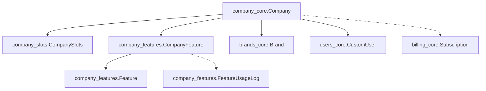

# Company System - Vue d'ensemble

## 🎯 Objectif du Système

Le système **company** est le cœur de la gestion multi-tenant de MEGAHUB. Il permet de gérer les entreprises clientes, leurs abonnements aux fonctionnalités, et leurs quotas d'utilisation dans un modèle pay-per-brand scalable.

## 🏗️ Architecture du Système

Le système company est composé de **3 apps Django** interconnectées :

### 📦 Apps du Système

| App | Responsabilité | URL Base |
|-----|---------------|----------|
| **company_core** | Gestion des entreprises principales | `/companies/` |
| **company_features** | Abonnements aux fonctionnalités | `/companies/features/` |
| **company_slots** | Quotas brands/users (pay-per-brand) | `/companies/slots/` |

### 🔗 Relations entre Apps



## 🎯 Concepts Clés

### 1. **Multi-Tenant Architecture**
- Chaque `Company` = tenant isolé
- Données partagées entre users de la même company
- Isolation stricte entre companies

### 2. **Pay-per-Brand Model**
```python
# CompanySlots - Facturation à l'unité
brands_slots = 5     # 5 brands max (payant)
users_slots = 10     # 10 users max (payant)
current_brands_count = 3  # Usage actuel
current_users_count = 7   # Usage actuel
```

### 3. **Business Mode Detection**
```python
# Détection automatique du type business
def get_business_mode(self):
    brands_count = self.brands.filter(is_deleted=False).count()
    if brands_count == 1:
        return 'solo'      # Business solo
    elif brands_count >= 2:
        return 'agency'    # Agence multi-brands
    else:
        return 'empty'     # Pas de brand active
```

### 4. **Trial System Intégré**
```python
# Système de trial natif
trial_expires_at = models.DateTimeField(null=True, blank=True)

def is_in_trial(self):
    return timezone.now() <= self.trial_expires_at

def trial_days_remaining(self):
    return (self.trial_expires_at - timezone.now()).days
```

### 5. **Feature Subscription System**
```python
# Features disponibles sur la plateforme
Feature.FEATURE_TYPES = [
    ('websites', 'Sites Web'),
    ('templates', 'Templates IA'),
    ('tasks', 'Gestion de tâches'),
    ('analytics', 'Analytics'),
    ('crm', 'CRM'),
    ('integrations', 'Intégrations'),
]

# Abonnement company à feature avec usage tracking
CompanyFeature.usage_limit = 100     # Limite mensuelle
CompanyFeature.current_usage = 45    # Usage actuel
```

## 🔑 Fonctionnalités Principales

### ✅ Gestion Companies
- **CRUD companies** avec admin auto-créé
- **Trial management** (14 jours par défaut)
- **Business mode detection** (solo/agency)
- **Billing integration** (Stripe)

### ✅ Slots Management (Pay-per-Brand)
- **Quotas configurables** brands/users
- **Usage tracking automatique**
- **Limite enforcement** en temps réel
- **Alertes seuils** (80% et 100%)

### ✅ Features Subscription
- **Catalogue features** centralisé
- **Abonnements par company** avec limites
- **Usage metering** granulaire
- **Analytics d'utilisation**

### ✅ Permissions & Security
- **Permissions granulaires** par rôle
- **Isolation multi-tenant** stricte
- **Validation slots** avant actions
- **Audit trails** complets

## 📊 Métriques Business

### 1. **Company Health Check**
```python
GET /companies/{id}/usage_stats/
{
    "slots": {
        "brands": {"used": 3, "total": 5, "percentage": 60},
        "users": {"used": 7, "total": 10, "percentage": 70}
    },
    "features": {
        "websites": {"usage": 45, "limit": 100},
        "templates": {"usage": 12, "limit": 50}
    },
    "trial": {
        "is_active": true,
        "days_remaining": 8
    }
}
```

### 2. **Feature Analytics**
```python
GET /companies/features/subscriptions/usage-stats/
{
    "global_stats": {
        "total_features": 150,
        "active_features": 120,
        "over_limit_features": 5,
        "activation_rate": 80.0
    },
    "stats_by_type": {
        "websites": {"total": 50, "active": 45, "total_usage": 1250},
        "templates": {"total": 30, "active": 28, "total_usage": 890}
    }
}
```

## 🚀 Workflows Typiques

### 1. **Création Company + Trial**
```python
# 1. POST /companies/
# 2. Auto-création admin user
# 3. Auto-création CompanySlots par défaut
# 4. Trial 14 jours activé
# 5. Features de base assignées
```

### 2. **Upgrade Pay-per-Brand**
```python
# 1. POST /companies/{id}/upgrade_slots/
# 2. Validation current_usage < new_limit
# 3. Update billing si nécessaire
# 4. Activation immédiate nouveaux slots
```

### 3. **Feature Subscription**
```python
# 1. POST /companies/features/subscriptions/
# 2. Vérification feature disponible
# 3. Configuration limites usage
# 4. Tracking usage immédiat
```

## 📈 Scalabilité & Performance

### **Optimisations Bases de Données**
```python
# Indexes optimisés
Company: ['is_active', 'stripe_customer_id', 'trial_expires_at']
CompanyFeature: ['is_enabled', 'expires_at', 'company+is_enabled']
CompanySlots: ['company']
```

### **Prefetch Optimisés**
```python
queryset = Company.objects.select_related('admin').prefetch_related(
    'brands', 'members', 'slots', 'company_features__feature'
)
```

### **Usage Tracking Asynchrone**
```python
# FeatureUsageLog pour analytics différées
# CompanyFeature.current_usage pour validation temps réel
```

## 🔐 Sécurité & Permissions

### **Niveaux d'Accès**
- **Superuser** : Accès tous companies + création companies
- **Company Admin** : Accès uniquement sa company
- **Brand Admin** : Accès brands assignées
- **Brand Member** : Lecture seule brands assignées

### **Validation Automatique**
```python
def get_queryset(self):
    if user.is_superuser:
        return queryset  # Tout
    elif user.company:
        return queryset.filter(id=user.company_id)  # Sa company
    else:
        return queryset.none()  # Rien
```

Cette architecture garantit une **scalabilité multi-tenant**, un **modèle de facturation flexible**, et une **sécurité robuste** pour la croissance de MEGAHUB.