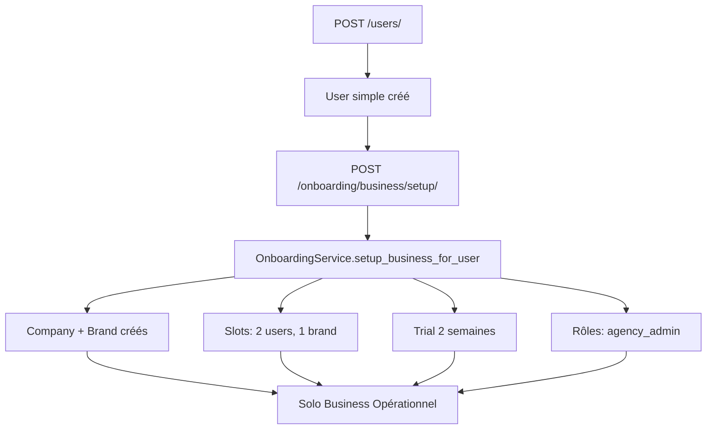
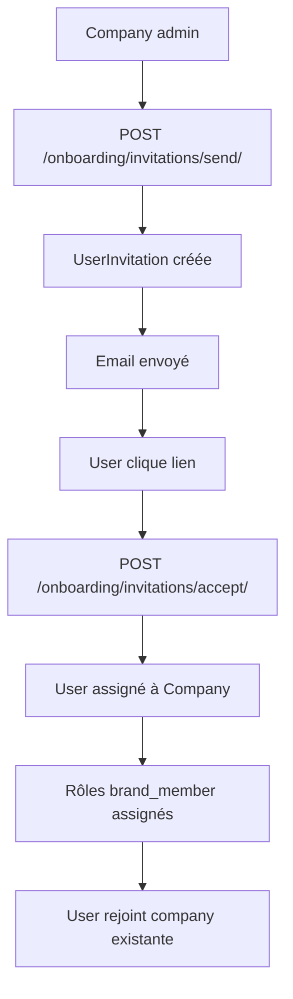
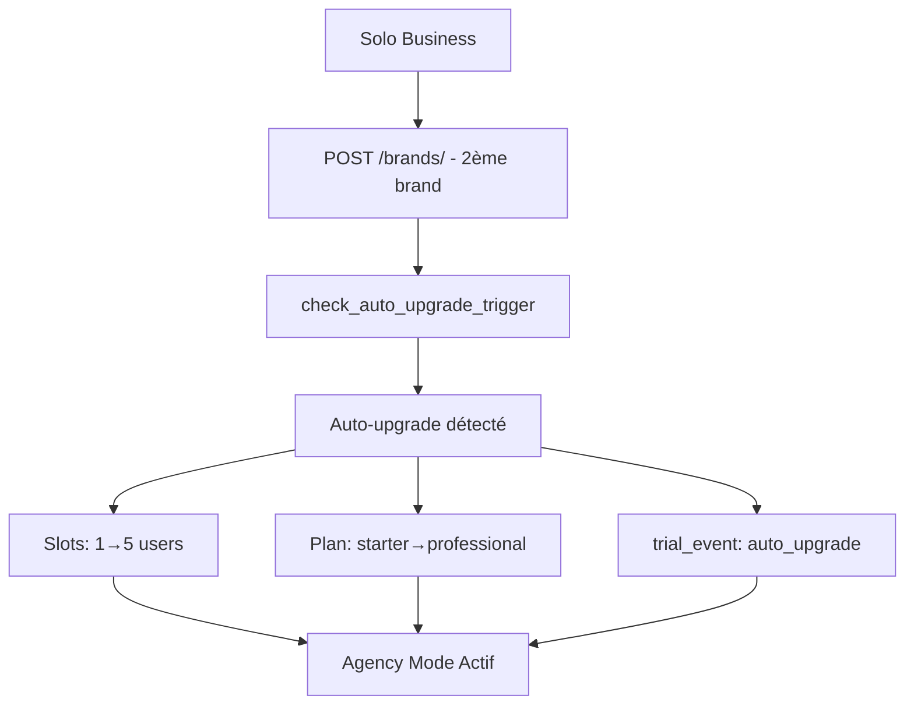

# 🚀 Système Onboarding - Guide Complet

## 📋 Table des Matières
- [Vue d'ensemble](#vue-densemble)
- [Architecture](#architecture)
- [Flow Principal](#flow-principal)
- [APIs Disponibles](#apis-disponibles)
- [Business Logic](#business-logic)
- [Développement](#développement)

---

## 🎯 Vue d'ensemble

Le système d'onboarding gère le **cycle de vie complet** des utilisateurs :
- **Inscription** et création de business
- **Invitations** d'utilisateurs  
- **Gestion des trials** et upgrades
- **Évolution solo → agency**

### **Philosophie Architecture**
✅ **Explicite** - Pas de signal automatique, flow contrôlé  
✅ **Modulaire** - 4 apps spécialisées  
✅ **Business-first** - Logique métier claire  
✅ **Scalable** - Multi-tenant avec company scoping  

---

## 🏗️ Architecture

### **Apps Structure**
```
📦 onboarding_registration   # Inscription & validation users
📦 onboarding_business       # Création business explicite (CORE)
📦 onboarding_invitations    # Invitations utilisateurs  
📦 onboarding_trials         # Trial management & upgrades
```

### **Core Dependencies** 
```
🏢 company_core      # Models Company
🎯 brands_core       # Models Brand  
👥 users_core        # Models CustomUser
🔐 users_roles       # Permissions granulaires
💳 billing_core      # Plans & facturation
🎛️ company_slots     # Quotas users/brands
⚡ company_features  # Features company
```

---

## 🔄 Flow Principal

### **1. Inscription Solo Business** 


### **2. Invitation Utilisateur**


### **3. Auto-upgrade Solo → Agency**


---

## 📡 APIs Disponibles

### **🏢 Business Setup (Core)**
```bash
# Setup business explicite
POST /onboarding/business/setup/
{
  "business_name": "Mon Business"  # optionnel
}

# Status complet onboarding  
GET /onboarding/business/setup-status/

# Vérifier éligibilité
GET /onboarding/business/check-eligibility/

# Stats détaillées
GET /onboarding/business/stats/
```

### **📧 Invitations**
```bash
# Envoyer invitation
POST /onboarding/invitations/send/
{
  "email": "user@example.com",
  "brand_id": 1,
  "user_type": "brand_member",
  "message": "Rejoins notre équipe !"
}

# Accepter invitation
POST /onboarding/invitations/accept/
{
  "token": "uuid-token"
}

# Status invitation  
GET /onboarding/invitations/status/{token}/
```

### **📊 Trials & Upgrades**
```bash
# Status trial complet
GET /onboarding/trials/status/

# Étendre trial
POST /onboarding/trials/extend/
{
  "additional_weeks": 1
}

# Upgrade manuel
POST /onboarding/trials/upgrade/
{
  "plan_type": "professional"
}
```

---

## 💼 Business Logic

### **Solo Business (Default)**
```json
{
  "company": {
    "name": "Business de John",
    "admin": "john@example.com",
    "business_mode": "solo"
  },
  "brand": {
    "name": "Brand Business de John",
    "brand_admin": "john@example.com"
  },
  "slots": {
    "users_slots": 2,     // Commerçant + stagiaire
    "brands_slots": 1,    // 1 brand par défaut
    "current_users": 1,
    "current_brands": 1
  },
  "trial": {
    "duration": "2 weeks",
    "features": ["websites", "templates", "analytics"]
  }
}
```

### **Agency Business (Auto-upgrade)**
```json
{
  "trigger": "2+ brands créées",
  "changes": {
    "users_slots": "1 → 5",
    "plan": "starter → professional",
    "business_mode": "solo → agency"
  },
  "billing": {
    "auto_upgrade": true,
    "pro_rate": true
  }
}
```

### **User Types & Permissions**
```bash
agency_admin   # Company owner, tous pouvoirs
brand_admin    # Admin d'une brand spécifique  
brand_member   # Membre d'une brand
client_readonly # Client avec accès lecture seule
```

### **Trial Events Tracking**
```bash
trial_start     # Trial démarré
trial_warning_7 # Avertissement 7 jours
trial_warning_3 # Avertissement 3 jours  
trial_warning_1 # Avertissement 1 jour
trial_expired   # Trial expiré
auto_upgrade    # Upgrade automatique solo→agency
manual_upgrade  # Upgrade manuel utilisateur
```

---

## 🛠️ Développement

### **Setup Local**
```bash
# Apps onboarding installées par défaut
INSTALLED_APPS = [
    'onboarding_registration',
    'onboarding_business', 
    'onboarding_invitations',
    'onboarding_trials',
]

# Signal désactivé - architecture explicite
# onboarding_registration/apps.py
def ready(self):
    pass  # Signal auto désactivé
```

### **Tests Pattern**
```python
# Test inscription explicite
def test_explicit_business_setup():
    user = User.objects.create(username="test", email="test@example.com")
    
    # User simple (pas de business auto)
    assert user.company is None
    
    # Setup explicite
    response = client.post('/onboarding/business/setup/', {
        'business_name': 'Test Business'
    })
    
    user.refresh_from_db()
    assert user.company is not None
    assert user.user_type == 'agency_admin'
```

### **Services Utilisation**
```python
from onboarding_business.services import OnboardingService

# Setup business programmatique
result = OnboardingService.setup_business_for_user(
    user=user,
    business_name="Mon Business"
)

# Vérification éligibilité
is_eligible = OnboardingService.is_user_eligible_for_business(user)

# Status complet
status = OnboardingService.get_user_business_status(user)
```

### **Permissions Custom**
```python
from onboarding_business.permissions import CanSetupBusiness

class MyView(APIView):
    permission_classes = [IsAuthenticated, CanSetupBusiness]
    
    def post(self, request):
        # Seuls users sans company peuvent setup
        pass
```

---

## 🚦 Monitoring & Debugging

### **Logs Importants**
```bash
# Setup business
INFO "Business créé avec succès pour {username}"

# Auto-upgrade  
INFO "Auto-upgrade déclenché pour {company}: {brands_count} brands"

# Invitations
INFO "Invitation envoyée: {email} -> {brand} par {inviter}"

# Trial warnings
INFO "Trial warnings envoyés: {count}"
```

### **Endpoints Debug**
```bash
# Status complet utilisateur
GET /onboarding/business/setup-status/

# Events trial d'une company  
GET /onboarding/trials/events/?company_id=1

# Invitations pending
GET /onboarding/invitations/list/?status=pending
```

### **Métriques Business**
```bash
# Companies en trial
GET /onboarding/trials/status/ → trial analytics

# Auto-upgrade candidates  
GET /onboarding/trials/upgrade-detection/

# Usage slots companies
GET /companies/slots/ → slots analytics
```

---

## 🎯 Bonnes Pratiques

### **✅ Do**
- Utiliser **endpoints explicites** pour business setup
- Valider **éligibilité** avant chaque action  
- Tracker **events trial** pour analytics
- Utiliser **permissions business** appropriées
- Gérer **erreurs métier** avec exceptions custom

### **❌ Don't**  
- Réactiver le signal automatique  
- Créer business sans validation slots
- Ignorer contraintes OneToOneField Company.admin
- Bypass validation invitation permissions
- Créer users sans company scoping

---

## 📈 Roadmap

### **Phase 1 - Actuel ✅**
- Architecture explicite complète
- Solo business avec trial 2 semaines  
- Invitations utilisateurs fonctionnelles
- Auto-upgrade solo → agency

### **Phase 2 - À venir**
- **Multi-brand setup** dès création  
- **Custom trial durations** par business type
- **Advanced billing integration** avec Stripe
- **Onboarding analytics** dashboard

### **Phase 3 - Futur**
- **White-label onboarding** pour partners
- **Advanced user roles** avec permissions custom
- **Company templates** pré-configurés  
- **Automated trial conversion** avec ML

---

## 🤝 Support

**Architecture Review** : Documentation apps complète disponible  
**Business Logic** : Tous les services sont documentés inline  
**API Reference** : Endpoints avec examples dans URLconfs  
**Debugging** : Logs structurés + monitoring endpoints  

Le système d'onboarding est **production-ready** avec une architecture **robuste et évolutive** ! 🚀