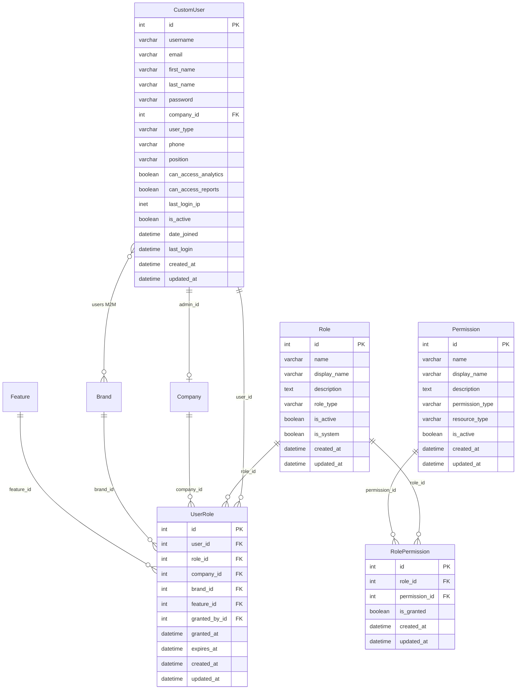

# Users System - Modèles de Données Détaillés

## 🎯 Architecture des Modèles

Le système users utilise une architecture relationnelle sophistiquée pour la **gestion multi-tenant** avec **permissions granulaires contextuelles**.



## 👤 **CUSTOM USER** - Modèle Principal

### **Structure Table**

```sql
CREATE TABLE custom_user (
    id                      SERIAL PRIMARY KEY,
    username                VARCHAR(150) NOT NULL UNIQUE,
    email                   VARCHAR(254) NOT NULL UNIQUE,
    first_name              VARCHAR(150) NOT NULL DEFAULT '',
    last_name               VARCHAR(150) NOT NULL DEFAULT '',
    password                VARCHAR(128) NOT NULL,
    company_id              INTEGER REFERENCES company(id) ON DELETE CASCADE,
    user_type               VARCHAR(20) NOT NULL DEFAULT 'brand_member',
    phone                   VARCHAR(20) NOT NULL DEFAULT '',
    position                VARCHAR(100) NOT NULL DEFAULT '',
    can_access_analytics    BOOLEAN NOT NULL DEFAULT false,
    can_access_reports      BOOLEAN NOT NULL DEFAULT false,
    last_login_ip           INET,
    is_active               BOOLEAN NOT NULL DEFAULT true,
    is_staff                BOOLEAN NOT NULL DEFAULT false,
    is_superuser            BOOLEAN NOT NULL DEFAULT false,
    date_joined             TIMESTAMP WITH TIME ZONE NOT NULL DEFAULT now(),
    last_login              TIMESTAMP WITH TIME ZONE,
    created_at              TIMESTAMP WITH TIME ZONE NOT NULL DEFAULT now(),
    updated_at              TIMESTAMP WITH TIME ZONE NOT NULL DEFAULT now()
);
```

### **Indexes Optimisés**

```sql
CREATE UNIQUE INDEX idx_custom_user_username ON custom_user(username);
CREATE UNIQUE INDEX idx_custom_user_email ON custom_user(email);
CREATE INDEX idx_custom_user_company_active ON custom_user(company_id, is_active);
CREATE INDEX idx_custom_user_type ON custom_user(user_type);
CREATE INDEX idx_custom_user_last_login ON custom_user(last_login);
```

### **Champs Détaillés**

| Champ | Type | Contraintes | Description | Exemple |
|-------|------|-------------|-------------|---------|
| `id` | SERIAL | PK | Identifiant unique | 1 |
| `username` | VARCHAR(150) | UNIQUE, NOT NULL | Nom d'utilisateur | "john_doe" |
| `email` | VARCHAR(254) | UNIQUE, NOT NULL | Email | "john@acme.com" |
| `first_name` | VARCHAR(150) | DEFAULT='' | Prénom | "John" |
| `last_name` | VARCHAR(150) | DEFAULT='' | Nom | "Doe" |
| `company_id` | INTEGER | FK, NULLABLE | Entreprise d'appartenance | 42 |
| `user_type` | VARCHAR(20) | NOT NULL, CHOICES | Type d'utilisateur | "brand_admin" |
| `phone` | VARCHAR(20) | DEFAULT='' | Téléphone | "+33123456789" |
| `position` | VARCHAR(100) | DEFAULT='' | Poste | "Marketing Manager" |
| `can_access_analytics` | BOOLEAN | DEFAULT=false | Accès analytics clients | true |
| `can_access_reports` | BOOLEAN | DEFAULT=false | Accès rapports clients | false |
| `last_login_ip` | INET | NULLABLE | Dernière IP connexion | "192.168.1.100" |

### **User Types - Énumération**

```sql
ALTER TABLE custom_user ADD CONSTRAINT chk_user_type 
    CHECK (user_type IN ('agency_admin', 'brand_admin', 'brand_member', 'client_readonly'));
```

| Type | Description | Permissions de Base |
|------|-------------|-------------------|
| `agency_admin` | Admin Agence | Contrôle total company + toutes brands |
| `brand_admin` | Admin Marque | Contrôle brands assignées + gestion users |
| `brand_member` | Membre Marque | Accès lecture/écriture brands assignées |
| `client_readonly` | Client Lecture | Dashboards spécialisés en lecture seule |

### **Relations M2M avec Brands**

```sql
CREATE TABLE custom_user_brands (
    id          SERIAL PRIMARY KEY,
    customuser_id INTEGER NOT NULL REFERENCES custom_user(id) ON DELETE CASCADE,
    brand_id    INTEGER NOT NULL REFERENCES brand(id) ON DELETE CASCADE,
    UNIQUE(customuser_id, brand_id)
);

CREATE INDEX idx_custom_user_brands_user ON custom_user_brands(customuser_id);
CREATE INDEX idx_custom_user_brands_brand ON custom_user_brands(brand_id);
```

### **Contraintes Check**

```sql
-- Email valide
ALTER TABLE custom_user ADD CONSTRAINT chk_email_format 
    CHECK (email ~* '^[A-Za-z0-9._%-]+@[A-Za-z0-9.-]+\.[A-Za-z]{2,4}$');

-- Username non vide
ALTER TABLE custom_user ADD CONSTRAINT chk_username_not_empty 
    CHECK (trim(username) != '');

-- Phone format (optionnel)
ALTER TABLE custom_user ADD CONSTRAINT chk_phone_format 
    CHECK (phone = '' OR phone ~* '^\+?[0-9\s\-\(\)]{8,20}$');
```

### **Triggers Auto-Update Slots**

```sql
-- Trigger après ajout/suppression User
CREATE OR REPLACE FUNCTION update_company_users_count()
RETURNS TRIGGER AS $$
BEGIN
    UPDATE company_slots 
    SET current_users_count = (
        SELECT COUNT(*) FROM custom_user 
        WHERE company_id = COALESCE(NEW.company_id, OLD.company_id) 
        AND is_active = true
    ),
    last_users_count_update = now()
    WHERE company_id = COALESCE(NEW.company_id, OLD.company_id);
    
    RETURN COALESCE(NEW, OLD);
END;
$$ LANGUAGE plpgsql;

CREATE TRIGGER trg_user_update_slots
    AFTER INSERT OR UPDATE OR DELETE ON custom_user
    FOR EACH ROW
    EXECUTE FUNCTION update_company_users_count();
```

## 🎭 **ROLE** - Rôles Système

### **Structure Table**

```sql
CREATE TABLE role (
    id           SERIAL PRIMARY KEY,
    name         VARCHAR(50) NOT NULL UNIQUE,
    display_name VARCHAR(100) NOT NULL,
    description  TEXT NOT NULL DEFAULT '',
    role_type    VARCHAR(20) NOT NULL DEFAULT 'brand',
    is_active    BOOLEAN NOT NULL DEFAULT true,
    is_system    BOOLEAN NOT NULL DEFAULT false,
    created_at   TIMESTAMP WITH TIME ZONE NOT NULL DEFAULT now(),
    updated_at   TIMESTAMP WITH TIME ZONE NOT NULL DEFAULT now()
);
```

### **Indexes**

```sql
CREATE UNIQUE INDEX idx_role_name ON role(name);
CREATE INDEX idx_role_is_active ON role(is_active);
CREATE INDEX idx_role_type ON role(role_type);
CREATE INDEX idx_role_system ON role(is_system);
```

### **Champs Détaillés**

| Champ | Type | Contraintes | Description | Exemple |
|-------|------|-------------|-------------|---------|
| `id` | SERIAL | PK | Identifiant unique | 1 |
| `name` | VARCHAR(50) | UNIQUE, NOT NULL | Nom technique | "brand_admin" |
| `display_name` | VARCHAR(100) | NOT NULL | Nom d'affichage | "Administrateur de Marque" |
| `description` | TEXT | DEFAULT='' | Description détaillée | "Peut gérer une marque..." |
| `role_type` | VARCHAR(20) | CHOICES | Type de rôle | "brand" |
| `is_active` | BOOLEAN | DEFAULT=true | Rôle actif | true |
| `is_system` | BOOLEAN | DEFAULT=false | Rôle système non supprimable | false |

### **Role Types - Énumération**

```sql
ALTER TABLE role ADD CONSTRAINT chk_role_type 
    CHECK (role_type IN ('system', 'company', 'brand', 'feature'));
```

| Type | Description | Usage |
|------|-------------|--------|
| `'system'` | Rôles globaux | superuser, support |
| `'company'` | Rôles entreprise | company_admin, company_member |
| `'brand'` | Rôles marque | brand_admin, brand_editor |
| `'feature'` | Rôles par feature | analytics_viewer, templates_editor |

### **Contraintes**

```sql
-- Protection rôles système
ALTER TABLE role ADD CONSTRAINT chk_system_role_protection
    CHECK (NOT is_system OR is_active = true);
```

## 🔗 **USER ROLE** - Assignations Contextuelles

### **Structure Table**

```sql
CREATE TABLE user_role (
    id          SERIAL PRIMARY KEY,
    user_id     INTEGER NOT NULL REFERENCES custom_user(id) ON DELETE CASCADE,
    role_id     INTEGER NOT NULL REFERENCES role(id) ON DELETE CASCADE,
    company_id  INTEGER REFERENCES company(id) ON DELETE CASCADE,
    brand_id    INTEGER REFERENCES brand(id) ON DELETE CASCADE,
    feature_id  INTEGER REFERENCES feature(id) ON DELETE CASCADE,
    granted_by_id INTEGER REFERENCES custom_user(id) ON DELETE SET NULL,
    granted_at  TIMESTAMP WITH TIME ZONE NOT NULL DEFAULT now(),
    expires_at  TIMESTAMP WITH TIME ZONE,
    created_at  TIMESTAMP WITH TIME ZONE NOT NULL DEFAULT now(),
    updated_at  TIMESTAMP WITH TIME ZONE NOT NULL DEFAULT now(),
    
    UNIQUE(user_id, role_id, company_id, brand_id, feature_id)
);
```

### **Indexes Contextuels**

```sql
CREATE UNIQUE INDEX idx_user_role_unique ON user_role(user_id, role_id, company_id, brand_id, feature_id);
CREATE INDEX idx_user_role_user ON user_role(user_id);
CREATE INDEX idx_user_role_role ON user_role(role_id);
CREATE INDEX idx_user_role_expires ON user_role(expires_at);
CREATE INDEX idx_user_role_company ON user_role(company_id);
CREATE INDEX idx_user_role_brand ON user_role(brand_id);
CREATE INDEX idx_user_role_feature ON user_role(feature_id);
CREATE INDEX idx_user_role_granted_by ON user_role(granted_by_id);
```

### **Champs Détaillés**

| Champ | Type | Contraintes | Description | Exemple |
|-------|------|-------------|-------------|---------|
| `id` | SERIAL | PK | Identifiant unique | 1 |
| `user_id` | INTEGER | FK, NOT NULL | Utilisateur | 15 |
| `role_id` | INTEGER | FK, NOT NULL | Rôle assigné | 5 |
| `company_id` | INTEGER | FK, NULLABLE | Contexte entreprise | 1 |
| `brand_id` | INTEGER | FK, NULLABLE | Contexte marque | 3 |
| `feature_id` | INTEGER | FK, NULLABLE | Contexte feature | 7 |
| `granted_by_id` | INTEGER | FK, NULLABLE | Qui a accordé | 2 |
| `granted_at` | TIMESTAMP | auto_now_add | Date attribution | "2025-07-11T10:00:00Z" |
| `expires_at` | TIMESTAMP | NULLABLE | Date expiration | "2025-12-31T23:59:59Z" |

### **Exemples d'Assignations**

```sql
-- John est brand_admin de la marque ACME Brand
INSERT INTO user_role (user_id, role_id, company_id, brand_id, granted_by_id)
VALUES (15, 5, 1, 3, 2);

-- Jane peut voir les analytics d'ACME Corp
INSERT INTO user_role (user_id, role_id, company_id, feature_id, granted_by_id, expires_at)
VALUES (20, 8, 1, 2, 2, '2025-12-31 23:59:59');

-- Bob est company_admin de toute ACME Corp
INSERT INTO user_role (user_id, role_id, company_id, granted_by_id)
VALUES (25, 1, 1, 1);
```

### **Contraintes de Cohérence**

```sql
-- Brand doit appartenir à la company si les deux sont spécifiés
ALTER TABLE user_role ADD CONSTRAINT chk_brand_company_consistency
    CHECK (
        brand_id IS NULL OR company_id IS NULL OR 
        EXISTS (
            SELECT 1 FROM brand 
            WHERE id = brand_id AND company_id = user_role.company_id
        )
    );

-- Feature active
ALTER TABLE user_role ADD CONSTRAINT chk_feature_active
    CHECK (
        feature_id IS NULL OR 
        EXISTS (
            SELECT 1 FROM feature 
            WHERE id = feature_id AND is_active = true
        )
    );
```

### **Function is_active**

```sql
CREATE OR REPLACE FUNCTION user_role_is_active(expires_at_param TIMESTAMP WITH TIME ZONE)
RETURNS BOOLEAN AS $$
BEGIN
    RETURN expires_at_param IS NULL OR expires_at_param > now();
END;
$$ LANGUAGE plpgsql IMMUTABLE;
```

## 🔑 **PERMISSION** - Permissions Granulaires

### **Structure Table**

```sql
CREATE TABLE permission (
    id              SERIAL PRIMARY KEY,
    name            VARCHAR(100) NOT NULL UNIQUE,
    display_name    VARCHAR(150) NOT NULL,
    description     TEXT NOT NULL DEFAULT '',
    permission_type VARCHAR(20) NOT NULL,
    resource_type   VARCHAR(50) NOT NULL,
    is_active       BOOLEAN NOT NULL DEFAULT true,
    created_at      TIMESTAMP WITH TIME ZONE NOT NULL DEFAULT now(),
    updated_at      TIMESTAMP WITH TIME ZONE NOT NULL DEFAULT now()
);
```

### **Indexes**

```sql
CREATE UNIQUE INDEX idx_permission_name ON permission(name);
CREATE INDEX idx_permission_is_active ON permission(is_active);
CREATE INDEX idx_permission_resource_type ON permission(resource_type);
CREATE INDEX idx_permission_type ON permission(permission_type);
CREATE INDEX idx_permission_resource_perm ON permission(resource_type, permission_type);
```

### **Champs Détaillés**

| Champ | Type | Contraintes | Description | Exemple |
|-------|------|-------------|-------------|---------|
| `id` | SERIAL | PK | Identifiant unique | 1 |
| `name` | VARCHAR(100) | UNIQUE, NOT NULL | Nom technique unique | "websites_write" |
| `display_name` | VARCHAR(150) | NOT NULL | Nom d'affichage | "Écriture Sites Web" |
| `description` | TEXT | DEFAULT='' | Description détaillée | "Peut créer et modifier..." |
| `permission_type` | VARCHAR(20) | CHOICES | Type de permission | "write" |
| `resource_type` | VARCHAR(50) | NOT NULL | Type de ressource | "website" |
| `is_active` | BOOLEAN | DEFAULT=true | Permission active | true |

### **Permission Types - Énumération**

```sql
ALTER TABLE permission ADD CONSTRAINT chk_permission_type 
    CHECK (permission_type IN ('read', 'write', 'delete', 'admin'));
```

| Type | Description | Usage |
|------|-------------|--------|
| `'read'` | Lecture | Consultation données |
| `'write'` | Écriture | Création/modification |
| `'delete'` | Suppression | Suppression données |
| `'admin'` | Administration | Gestion complète |

### **Resource Types Exemples**

```sql
-- Exemples de resource_type
'website'       -- Sites web
'template'      -- Templates IA
'analytics'     -- Analytics
'user'          -- Gestion utilisateurs
'brand'         -- Gestion marques
'company'       -- Gestion entreprise
'feature'       -- Features plateforme
'report'        -- Rapports
'export'        -- Exports de données
'integration'   -- Intégrations
```

### **Permissions Standard**

```sql
-- Permissions Website
INSERT INTO permission (name, display_name, permission_type, resource_type) VALUES
('websites_read', 'Lecture Sites Web', 'read', 'website'),
('websites_write', 'Écriture Sites Web', 'write', 'website'),
('websites_delete', 'Suppression Sites Web', 'delete', 'website'),
('websites_admin', 'Administration Sites Web', 'admin', 'website');

-- Permissions Analytics
INSERT INTO permission (name, display_name, permission_type, resource_type) VALUES
('analytics_read', 'Lecture Analytics', 'read', 'analytics'),
('analytics_export', 'Export Analytics', 'write', 'analytics'),
('analytics_admin', 'Administration Analytics', 'admin', 'analytics');

-- Permissions Templates
INSERT INTO permission (name, display_name, permission_type, resource_type) VALUES
('templates_read', 'Lecture Templates', 'read', 'template'),
('templates_write', 'Création Templates', 'write', 'template'),
('templates_delete', 'Suppression Templates', 'delete', 'template'),
('templates_admin', 'Administration Templates', 'admin', 'template');
```

## 🔗 **ROLE PERMISSION** - Matrice Role-Permission

### **Structure Table**

```sql
CREATE TABLE role_permission (
    id            SERIAL PRIMARY KEY,
    role_id       INTEGER NOT NULL REFERENCES role(id) ON DELETE CASCADE,
    permission_id INTEGER NOT NULL REFERENCES permission(id) ON DELETE CASCADE,
    is_granted    BOOLEAN NOT NULL DEFAULT true,
    created_at    TIMESTAMP WITH TIME ZONE NOT NULL DEFAULT now(),
    updated_at    TIMESTAMP WITH TIME ZONE NOT NULL DEFAULT now(),
    
    UNIQUE(role_id, permission_id)
);
```

### **Indexes**

```sql
CREATE UNIQUE INDEX idx_role_permission_unique ON role_permission(role_id, permission_id);
CREATE INDEX idx_role_permission_role_granted ON role_permission(role_id, is_granted);
CREATE INDEX idx_role_permission_permission ON role_permission(permission_id);
```

### **Champs Détaillés**

| Champ | Type | Contraintes | Description | Exemple |
|-------|------|-------------|-------------|---------|
| `id` | SERIAL | PK | Identifiant unique | 1 |
| `role_id` | INTEGER | FK, NOT NULL | Rôle | 5 |
| `permission_id` | INTEGER | FK, NOT NULL | Permission | 12 |
| `is_granted` | BOOLEAN | DEFAULT=true | Permission accordée | true |

**Note** : `is_granted=false` permet de **refuser explicitement** une permission, utile pour l'héritage complexe de rôles.

### **Exemples Matrice Permissions**

```sql
-- Brand Admin permissions
INSERT INTO role_permission (role_id, permission_id, is_granted) VALUES
-- Websites
(5, 1, true),   -- websites_read
(5, 2, true),   -- websites_write
(5, 3, true),   -- websites_delete
(5, 4, false),  -- websites_admin (refusé explicitement)
-- Templates
(5, 5, true),   -- templates_read
(5, 6, true),   -- templates_write
(5, 7, false),  -- templates_delete (refusé)
-- Analytics
(5, 8, true),   -- analytics_read
(5, 9, false);  -- analytics_export (refusé)

-- Brand Member permissions (plus restrictives)
INSERT INTO role_permission (role_id, permission_id, is_granted) VALUES
-- Websites
(6, 1, true),   -- websites_read
(6, 2, true),   -- websites_write
(6, 3, false),  -- websites_delete (refusé)
-- Templates
(6, 5, true),   -- templates_read
(6, 6, false),  -- templates_write (refusé)
-- Analytics
(6, 8, true);   -- analytics_read
```

## 📊 **Vues Matérialisées Analytics**

### **User Permissions Summary**

```sql
CREATE MATERIALIZED VIEW mv_user_permissions_summary AS
SELECT 
    u.id as user_id,
    u.username,
    u.email,
    u.company_id,
    c.name as company_name,
    u.user_type,
    COUNT(DISTINCT ur.role_id) as total_roles,
    COUNT(DISTINCT ur.role_id) FILTER (WHERE user_role_is_active(ur.expires_at)) as active_roles,
    COUNT(DISTINCT rp.permission_id) FILTER (WHERE rp.is_granted) as total_permissions,
    ARRAY_AGG(DISTINCT r.display_name) FILTER (WHERE user_role_is_active(ur.expires_at)) as active_role_names,
    ARRAY_AGG(DISTINCT p.resource_type) FILTER (WHERE rp.is_granted AND user_role_is_active(ur.expires_at)) as accessible_resources
FROM custom_user u
LEFT JOIN company c ON c.id = u.company_id
LEFT JOIN user_role ur ON ur.user_id = u.id
LEFT JOIN role r ON r.id = ur.role_id
LEFT JOIN role_permission rp ON rp.role_id = r.id
LEFT JOIN permission p ON p.id = rp.permission_id
WHERE u.is_active = true
GROUP BY u.id, u.username, u.email, u.company_id, c.name, u.user_type;

CREATE INDEX idx_mv_user_permissions_summary_user_id ON mv_user_permissions_summary(user_id);
CREATE INDEX idx_mv_user_permissions_summary_company_id ON mv_user_permissions_summary(company_id);
```

### **Role Usage Analytics**

```sql
CREATE MATERIALIZED VIEW mv_role_usage_analytics AS
SELECT 
    r.id as role_id,
    r.name,
    r.display_name,
    r.role_type,
    COUNT(DISTINCT ur.user_id) as total_users,
    COUNT(DISTINCT ur.user_id) FILTER (WHERE user_role_is_active(ur.expires_at)) as active_users,
    COUNT(DISTINCT ur.company_id) as companies_count,
    COUNT(DISTINCT ur.brand_id) as brands_count,
    COUNT(DISTINCT rp.permission_id) FILTER (WHERE rp.is_granted) as permissions_count,
    AVG(CASE WHEN ur.expires_at IS NOT NULL 
        THEN EXTRACT(days FROM ur.expires_at - ur.granted_at) 
        ELSE NULL END) as avg_duration_days
FROM role r
LEFT JOIN user_role ur ON ur.role_id = r.id
LEFT JOIN role_permission rp ON rp.role_id = r.id
WHERE r.is_active = true
GROUP BY r.id, r.name, r.display_name, r.role_type;

CREATE INDEX idx_mv_role_usage_analytics_role_id ON mv_role_usage_analytics(role_id);
CREATE INDEX idx_mv_role_usage_analytics_type ON mv_role_usage_analytics(role_type);
```

## 🔧 **Optimisations Performance**

### **Indexes Composites Avancés**

```sql
-- Requêtes permissions user contextual
CREATE INDEX idx_user_role_context_active ON user_role(user_id, company_id, brand_id, feature_id) 
    WHERE user_role_is_active(expires_at);

-- Permissions par resource type
CREATE INDEX idx_permission_resource_active ON permission(resource_type, is_active) 
    WHERE is_active = true;

-- Rôles actifs par type
CREATE INDEX idx_role_type_active ON role(role_type, is_active) 
    WHERE is_active = true;

-- Assignations récentes
CREATE INDEX idx_user_role_recent ON user_role(granted_at DESC, user_id) 
    WHERE granted_at > now() - interval '30 days';
```

### **Partitioning UserRole par Date**

```sql
-- Partition par mois pour les assignations anciennes
CREATE TABLE user_role_y2025m07 PARTITION OF user_role
    FOR VALUES FROM ('2025-07-01') TO ('2025-08-01');

CREATE TABLE user_role_y2025m08 PARTITION OF user_role
    FOR VALUES FROM ('2025-08-01') TO ('2025-09-01');
```

### **Function Permission Check Optimisée**

```sql
CREATE OR REPLACE FUNCTION user_has_permission(
    p_user_id INTEGER,
    p_permission_name VARCHAR,
    p_company_id INTEGER DEFAULT NULL,
    p_brand_id INTEGER DEFAULT NULL,
    p_feature_id INTEGER DEFAULT NULL
)
RETURNS BOOLEAN AS $$
DECLARE
    permission_found BOOLEAN := false;
BEGIN
    -- Cache lookup avec contexte
    SELECT EXISTS(
        SELECT 1
        FROM user_role ur
        JOIN role_permission rp ON rp.role_id = ur.role_id
        JOIN permission p ON p.id = rp.permission_id
        WHERE ur.user_id = p_user_id
        AND p.name = p_permission_name
        AND rp.is_granted = true
        AND user_role_is_active(ur.expires_at)
        AND (p_company_id IS NULL OR ur.company_id = p_company_id OR ur.company_id IS NULL)
        AND (p_brand_id IS NULL OR ur.brand_id = p_brand_id OR ur.brand_id IS NULL)
        AND (p_feature_id IS NULL OR ur.feature_id = p_feature_id OR ur.feature_id IS NULL)
    ) INTO permission_found;
    
    RETURN permission_found;
END;
$$ LANGUAGE plpgsql STABLE;

-- Index pour la fonction
CREATE INDEX idx_user_permission_lookup ON user_role(user_id, role_id) 
    WHERE user_role_is_active(expires_at);
```

### **Cleanup Automatique**

```sql
-- Function cleanup rôles expirés
CREATE OR REPLACE FUNCTION cleanup_expired_user_roles()
RETURNS INTEGER AS $$
DECLARE
    deleted_count INTEGER;
BEGIN
    WITH expired_roles AS (
        DELETE FROM user_role 
        WHERE expires_at < now() - interval '7 days'
        RETURNING id
    )
    SELECT COUNT(*) FROM expired_roles INTO deleted_count;
    
    -- Refresh materialized views
    REFRESH MATERIALIZED VIEW CONCURRENTLY mv_user_permissions_summary;
    REFRESH MATERIALIZED VIEW CONCURRENTLY mv_role_usage_analytics;
    
    RETURN deleted_count;
END;
$$ LANGUAGE plpgsql;

-- Scheduler quotidien
-- SELECT cron.schedule('cleanup-expired-roles', '0 2 * * *', 'SELECT cleanup_expired_user_roles();');
```

Cette architecture garantit une **gestion sophistiquée des utilisateurs**, des **permissions granulaires contextuelles**, et des **performances optimales** pour l'écosystème multi-tenant complexe de MEGAHUB.